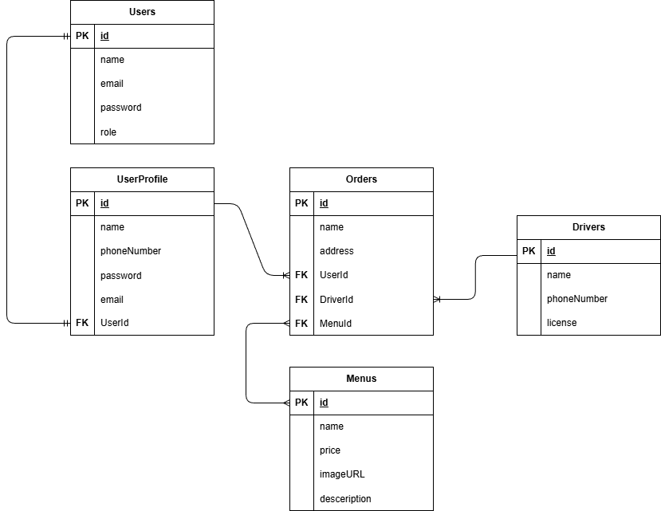

# GoBite — Food Ordering Web App

> **Pair Project** — Hacktiv8 Phase 1 Final Project

GoBite is a full-stack food ordering web application built with Node.js, Express, and PostgreSQL. Users can browse menus, place orders, track drivers, and generate invoices — all through a clean server-rendered UI.

---

## Team

| Name | GitHub |
|------|--------|
| Ratu Ramadhani | [@raturamadhani01](https://github.com/raturamadhani01) |
| Inmuhar Algozy | [@inmuharal](https://github.com/inmuharal) |

---

## Features

- **Authentication** — Register & login with session-based auth, role-based access (penjual / pembeli)
- **Menu Management** — Add, edit, delete, and search menus with image support (admin/penjual only)
- **Order Management** — Place orders with multiple menu items, assign driver, set delivery address
- **Driver Dashboard** — View all drivers and their assigned orders
- **Invoice Generator** — Generate a printable invoice for any order
- **Role-based Access Control** — Sellers manage menus, buyers place orders

---

## Tech Stack

| Layer | Technology |
|-------|-----------|
| Runtime | Node.js |
| Framework | Express.js v5 |
| Template Engine | EJS |
| ORM | Sequelize v6 |
| Database | PostgreSQL |
| Auth | express-session + bcryptjs |
| Dev | Nodemon, Sequelize CLI |

---

## Database Schema



**Models & Relations:**
- `User` has one `UserProfile`, has many `Order`
- `Order` belongs to `User`, belongs to `Driver`, belongs to many `Menu` (through `OrderMenu`)
- `Driver` has many `Order`
- `Menu` belongs to many `Order` (through `OrderMenu`)

---

## Getting Started

### Prerequisites
- Node.js >= 18
- PostgreSQL

### Installation

```bash
# Clone the repo
git clone https://github.com/raturamadhani01/Food.git
cd Food

# Install dependencies
npm install
```

### Database Setup

```bash
# Create database
npx sequelize-cli db:create

# Run migrations
npx sequelize-cli db:migrate

# Seed demo data
npx sequelize-cli db:seed:all
```

### Run the App

```bash
# Development (with auto-reload)
npx nodemon app.js

# Production
node app.js
```

App will run at **http://localhost:3000**

---

## Project Structure

```
GoBite/
├── app.js                  # Entry point
├── config/                 # Database config
├── controllers/            # Route handlers
├── helpers/                # Utilities (format, hash, role)
├── middlewares/            # Auth middleware
├── migrations/             # DB migrations
├── models/                 # Sequelize models
├── routers/                # Express routes
├── seeders/                # Demo data
└── views/                  # EJS templates
```

---

## Routes Overview

| Method | Path | Description | Access |
|--------|------|-------------|--------|
| GET | `/` | Landing page | Public |
| GET/POST | `/register` | Register | Public |
| GET/POST | `/login` | Login | Public |
| GET | `/logout` | Logout | Auth |
| GET | `/menus` | Browse menus | Auth |
| GET/POST | `/menus/add` | Add menu | Penjual |
| GET/POST | `/menus/:id/edit` | Edit menu | Penjual |
| POST | `/menus/:id/delete` | Delete menu | Penjual |
| GET | `/orders` | View orders | Auth |
| GET/POST | `/orders/add` | Place order | Pembeli |
| POST | `/orders/:id/delete` | Delete order | Auth |
| GET | `/orders/:id/invoice` | View invoice | Auth |
| GET | `/drivers` | Driver list | Auth |
